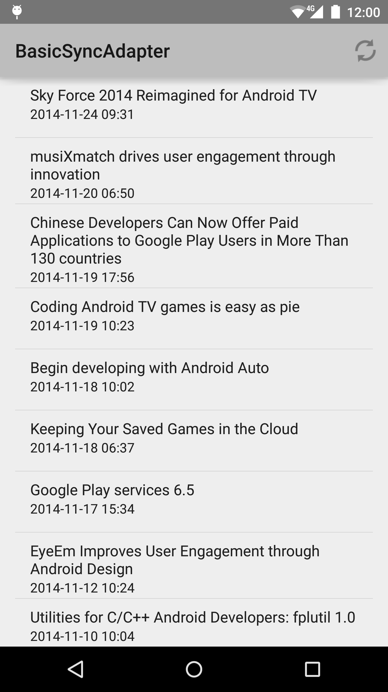

Android BasicSyncAdapter Sample
===================================

This sample demonstrates using SyncAdapter to fetch background
data for an app. It covers the creation of the required Service
that the OS uses to initiate the background data sync as well as
scheduling syncs with background data.

Introduction
------------

This sample demonstrates using SyncAdapter to fetch background data
for an app. SyncAdapters can be used to execute your data transfer
code at configurable intervals, while efficiently using battery and
other system resources.

This sample implements all the required elements of a sync adapter.
- Creates a sync adapter class.
- Creates a bound Service which the OS uses to initiate a sync.
- Defines the sync adapter properties in an XML resource file.
- Declares the bound Service in the app manifest.

For more on SyncAdapters refer to [Transferring Data Using Sync Adapters][1]

[1]: http://developer.android.com/training/sync-adapters/index.html

Pre-requisites
--------------

- Android SDK v23
- Android Build Tools v23.0.0
- Android Support Repository

Screenshots
-------------

 

Getting Started
---------------

This sample uses the Gradle build system. To build this project, use the
"gradlew build" command or use "Import Project" in Android Studio.

Support
-------

- Google+ Community: https://plus.google.com/communities/105153134372062985968
- Stack Overflow: http://stackoverflow.com/questions/tagged/android

If you've found an error in this sample, please file an issue:
https://github.com/googlesamples/android-BasicSyncAdapter

Patches are encouraged, and may be submitted by forking this project and
submitting a pull request through GitHub. Please see CONTRIBUTING.md for more details.

License
-------

Copyright 2014 The Android Open Source Project, Inc.

Licensed to the Apache Software Foundation (ASF) under one or more contributor
license agreements.  See the NOTICE file distributed with this work for
additional information regarding copyright ownership.  The ASF licenses this
file to you under the Apache License, Version 2.0 (the "License"); you may not
use this file except in compliance with the License.  You may obtain a copy of
the License at

http://www.apache.org/licenses/LICENSE-2.0

Unless required by applicable law or agreed to in writing, software
distributed under the License is distributed on an "AS IS" BASIS, WITHOUT
WARRANTIES OR CONDITIONS OF ANY KIND, either express or implied.  See the
License for the specific language governing permissions and limitations under
the License.
